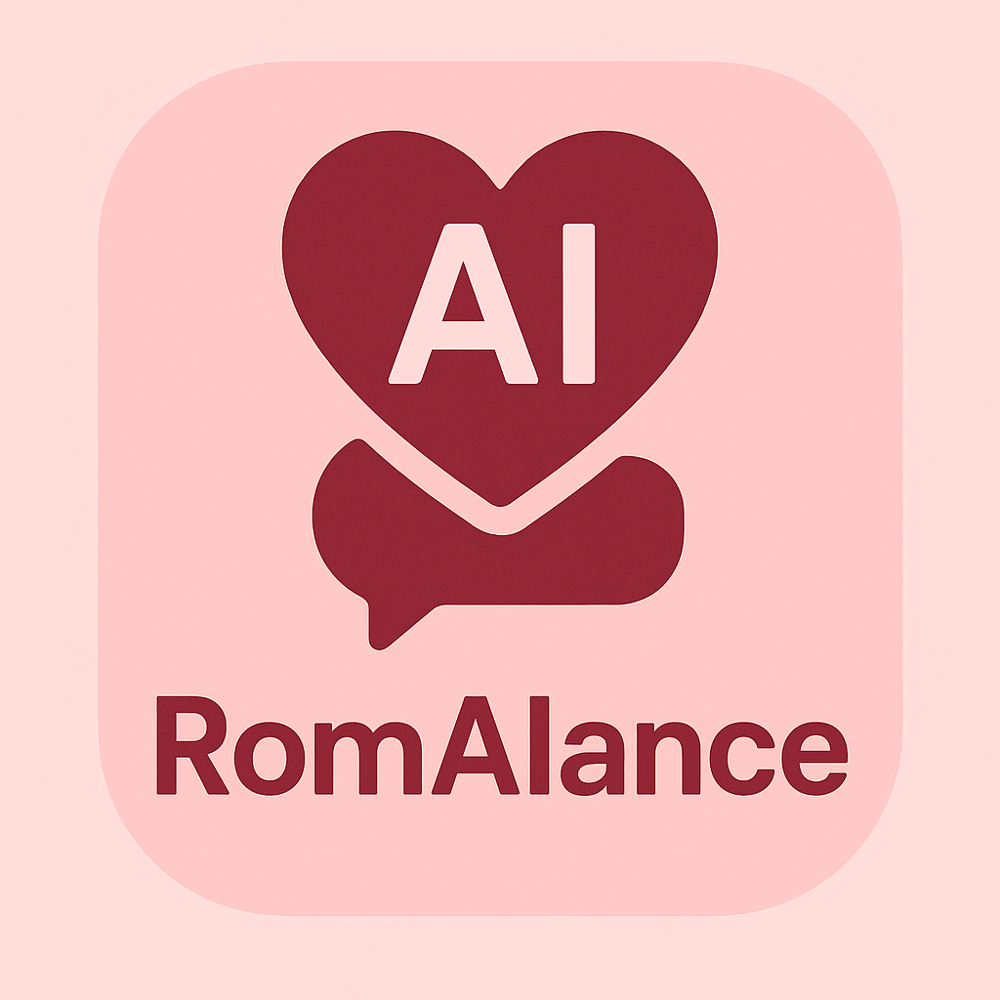

# RomAIance ❤️



## Overview
**RomAIance** is an interactive AI-powered matchmaking application that leverages a **Multi-Agent System** to help users:

- Build structured dating profiles  
- Find compatible matches  
- Compose personalized messages  

The project demonstrates how multiple agents can collaborate asynchronously using **Google ADK**, orchestrating tasks such as calling custom tools, reading and writing from a database, dynamically creating profiles, evaluating matches, and composing messages.

> ⚠️ **Disclaimer:** This project is for **educational and experimental purposes only**.  
> - AI-generated matches and messages are **not guaranteed** to be accurate, safe, or suitable for real-world dating.  
> - **All sample data included in this project are fictional** and do not represent real individuals.  
> - Use at your own risk. The author is **not responsible** for any outcomes from using this application.

This project was developed as part of the [**Agents Intensive - Capstone Project**](https://www.kaggle.com/competitions/agents-intensive-capstone-project) during the [**5-Day AI Agents Intensive Course**](https://www.kaggle.com/learn-guide/5-day-agents) with Google (Nov 10–14, 2025).

## 👤 Author

**Steven Lio**  
- Webpage: [https://stevenlio88.github.io/Portfolio/](https://stevenlio88.github.io/Portfolio/)  
- LinkedIn: [https://www.linkedin.com/in/steven-lio/](https://www.linkedin.com/in/steven-lio/)  

Built with ❤️ using **Google ADK**

## 🏗️ Architecture

### Multi-Agent System
The system is built using several specialized agents:

- **Profile Builder Agent**: Guides users to create a structured dating profile with preferences, hobbies, personality traits, and a bio.
- **Matchmaking Agent**: Retrieves available profiles, scores potential matches with reasoning, and presents the top recommendations.
- **Message Composer Agent**: Helps the user generate messages referencing shared interests and personality traits.

Agents communicate asynchronously and hand off tasks to each other via Google ADK.

## ⚠️ Caveats & Limitations
- The AI agents are powered by Google's [`gemini-2.5-flash-lite`](https://docs.cloud.google.com/vertex-ai/generative-ai/docs/models/gemini/2-5-flash-lite) model, which has **limitations in logical reasoning**. Sometimes it may misinterpret user preferences or fail to strictly enforce matching rules.  
- In certain cases, the agent may **not produce a response after a function call**, or provide incomplete reasoning.  
- AI-generated matches and messages are **suggestions only** and may not reflect real-world compatibility.  
- Users should **not rely on this app for real dating decisions**. This project is purely for experimentation and learning.  

## 🚀 Quick Start

⚠️ Note: RomAIance requires Python 3.9+.

1. Install dependencies
```bash
pip install -r requirements.txt
```

2. Set your Google API key (Generated by [Google AI Studio](https://aistudio.google.com/app/api-keys))
```bash
# Linux/macOS
export GOOGLE_API_KEY="your-api-key"

# Windows
set GOOGLE_API_KEY="your-api-key"
```

3. Run the application from the root directory
``` bash
python -m RomAIance.app
```
>⚠️ Make sure you are in the root directory of the project (RomAIance/) when running this command so all relative paths work correctly.

## 📖 How It Works

### Phase 1: Collect Basic User Information
- Users are guided step-by-step to provide:
    - Name
    - Age
    - Gender
    - Sexual Orientation

### Phase 2: Profile Creation with Confirmation
- User interact with agent to create detailed profile
    - Preferences (relationship type, age range, etc.)
    - Hobbies
    - Personality traits
    - Bio

After all information is collected, the agent confirms before saving the profile.

### Phase 3: Match Finding with Confirmation

**Conversation Flow:**

1. Matchmaker retrieves all profiles (excluding the current user).
2. LLM evaluates each potential match using strict reasoning about:
    - Sexual orientation compatibility
    - Shared interests
    - Personality traits
    - Age and relationship goals
3. Scores each match 0-100 and presents the top 3 with detailed explanations.
4. Asks the user: "Which match interests you?"
5. Prompts: "Would you like to send a message to [Name]?"
    - Yes -> proceeds to message composer
    - No -> returns to matchmaker for further interaction

User is allowed to update their profile and find new matches again, or pointing out the problems with the matches to refine.

### Phase 4: Message Composition

**Conversation Flow:**

1. Asks user to choose a tone: casual, warm, playful, or thoughtful.
2. LLM drafts a personalized message referencing shared interests. User can also update their profile again here.
3. Shows draft message to the user.
4. Asks for confirmation to send.
5. Sends message or allows user to regenerate if desired.

## 💬 Example Conversation Flow

### Phase 1: Basic info gathering
```
💘 Welcome to RomAIance! 💘
============================================================

What's your name? Bramblefoot
What's your age? 42
What's your gender? Male
What's your sexual orientation? Female
Session created: 82af38ab-202a-4cec-ab71-283461b70c26
User id: user_cbde9cfb

Bramblefoot: Hi! My name is Bramblefoot, I'm 42 years old, Male, and I'm interested in Female. I'd like to create my dating profile.
```

### Phase 2: Detail profile creation
```
Assistant: Hi Bramblefoot! I'm the profile_builder agent, and I'm here to help you create your dating profile. Let's get started!

First, what are you looking for in a relationship? Are you interested in something casual, long-term, or perhaps something else? And what's your preferred age range for a partner?

------------------------------------------------------------

Bramblefoot: I am looking for someone for a long-term relationship. Ideally someone 35 to 55 years old.

Assistant: Great! So, you're looking for a long-term relationship with someone between 35 and 55 years old.

Now, tell me about yourself! What are some of your hobbies and interests? I'd love to know what you enjoy doing in your free time. (You can list 2-4 things!)

------------------------------------------------------------

Bramblefoot: I enjoyed exploring hidden paths, gardening and herbology as well as cooking.

Assistant: That sounds wonderful, Bramblefoot! Exploring, gardening, herbology, and cooking are all such rich and engaging interests.

Now, let's add a little more about your personality. How would you describe yourself in 2-3 words? For example, are you adventurous, laid-back, ambitious, witty, etc.?

------------------------------------------------------------

Bramblefoot: I am cheerful and optimistic, curious, adventurous and loyal.

Assistant: Those are fantastic qualities, Bramblefoot! Cheerful, optimistic, curious, adventurous, and loyal – that paints a great picture!

Now, let's craft a short bio for you, something that's 2-3 sentences and captures your essence. Based on what you've shared – your interests in exploring, gardening, cooking, and your personality traits – what do you think would be a good way to describe yourself?

For example, we could say something like: "An adventurous soul with a passion for the outdoors, I find joy in tending my garden and exploring hidden paths. My optimistic spirit and curious nature lead me to the kitchen, where I love to cook and share good food. I'm a loyal friend and partner, always looking for the next discovery."

How does that sound, or would you like to tweak it or try something different?

------------------------------------------------------------

Bramblefoot: That sounds great.

Assistant: Wonderful! So, to confirm, you're happy with this bio: "An adventurous soul with a passion for the outdoors, I find joy in tending my garden and exploring hidden paths. My optimistic spirit and curious nature lead me to the kitchen, where I love to cook and share good food. I'm a loyal friend and partner, always looking for the next discovery."

And we have all the information needed:
*   **Name:** Bramblefoot
*   **Age:** 42
*   **Gender:** Male
*   **Sexual Orientation:** Female
*   **Preferences:** Looking for a long-term relationship, age range 35-55, relationship type long-term.
*   **Hobbies:** Exploring hidden paths, gardening, herbology, cooking
*   **Personality Traits:** Cheerful, optimistic, curious, adventurous, loyal
*   **Bio:** An adventurous soul with a passion for the outdoors, I find joy in tending my garden and exploring hidden paths. My optimistic spirit and curious nature lead me to the kitchen, where I love to cook and share good food. I'm a loyal friend and partner, always looking for the next discovery.

Would you like me to save your profile now?

------------------------------------------------------------

Bramblefoot: Yes please.

Assistant: Your profile has been saved successfully! Thank you for providing all your information, Bramblefoot.

Would you like to start finding matches now?

Bramblefoot: Yes I am ready.
------------------------------------------------------------
```

### Phase 3: Match making
```
Assistant: I've retrieved all profiles and your own profile. Now I'll analyze them to find the best matches for you!

Here are your top 3 matches:

Match #1: Hana (73/100)
- Age: 30 | Gender: Female | Sexual Orientation: Bisexual
- Bio: Soft-spoken yet deeply passionate about art and slow living. If you enjoy museums and fresh bread, we'll get along well.
- Why compatible: Hana's interests in art and baking align with your love for cooking and herbology. Her calm and intellectual personality would complement your cheerful and optimistic nature, creating a balanced and harmonious connection.

Match #2: Priya (65/100)
- Age: 26 | Gender: Female | Sexual Orientation: Straight
- Bio: Art lover and street-food explorer. I enjoy good conversations, creative sparks, and unplanned adventures.
- Why compatible: Priya's appreciation for art and exploring new things, along with her open-minded personality, would resonate with your adventurous and curious spirit. Her interest in street food could lead to fun culinary explorations together.

Match #3: Jordan (63/100)
- Age: 30 | Gender: Female | Sexual Orientation: Heterosexual
- Bio: Artist and outdoor enthusiast. Love painting landscapes after a good climb. Music festivals are my happy place.
- Why compatible: Jordan's artistic side and love for the outdoors complement your adventurous and nature-loving interests. Her passion for painting and climbing could spark shared activities and create a vibrant connection.

------------------------------------------------------------

Bramblefoot: Priya sounds fun to be with.
```

### Phase 4: Draft and send personalized message
```
Assistant: Hello Bramblefoot! I'm the message_composer agent, and I'm here to help you craft a personalized message to Priya.

To make sure I write the perfect message, could you tell me what kind of tone you'd like?
*   Casual and friendly
*   Warm and genuine
*   Playful and fun
*   Thoughtful and deep

------------------------------------------------------------

Bramblefoot: I think something playful and fun is more like me.

 Assistant: Perfect! Here's a message for Priya with a playful and fun tone, referencing your shared interests:

"Hey Priya! I saw you're an art lover and street-food explorer – sounds like my kind of adventure! I love trying new recipes and finding hidden gems, so I'm curious, what's the most interesting street food you've ever dared to try? 😉"

Would you like me to send this?

------------------------------------------------------------

Bramblefoot: It looks great. Yes please.

 Assistant: Message sent to Priya! 🎉

Good luck with your match! I hope you two have a wonderful conversation. Feel free to come back anytime to find more matches or get help with messages.

Take care! 💘


============================================================
✨ Session completed successfully! ✨
============================================================
```

## 🔧 Project Structure

```
RomAIance/
├─ __init__.py
├─ agent.py
├─ app.py
├─ config.py
├─ db
│  └─ matchmaking_data.db
|  └─ sample_users.json
├─ init_db.py
├─ sub_agents
│  ├─ matchmaker_agent.py
│  ├─ message_composer_agent.py
│  └─ profile_builder_agent.py
└─ tools.py
```

## 📚 Learn More

- [Google ADK Documentation](https://google.github.io/adk-docs/)
- [Google ADK Samples (Python)](https://github.com/google/adk-samples)
- [Google ADK GitHub (Python)](https://github.com/google/adk-python)